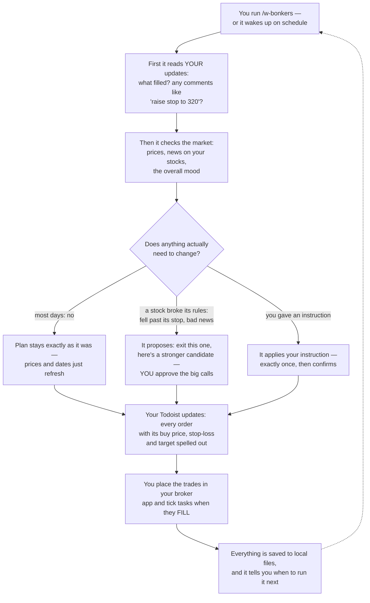
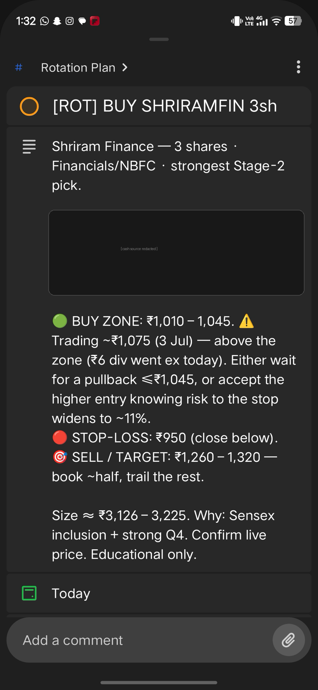
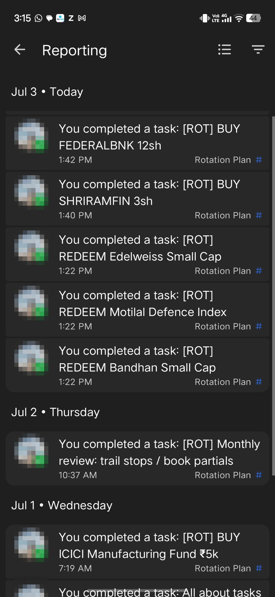
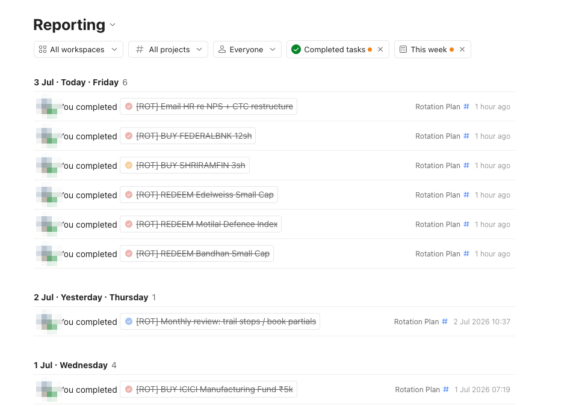

<div align="center">

<h1>w-bonkers</h1>

<p><b>Your AI agent runs your stock plan on rails. You just take the W.</b></p>

<p>
<a href="LICENSE"></a>
<a href="docs/PREREQUISITES.md"></a>
<a href="docs/PIPELINE.md"></a>
<a href="https://somm.tf"></a>
</p>

<p>
<a href="#install">Install</a> ·
<a href="#how-it-works">How it works</a> ·
<a href="#what-it-looks-like-after-setup">Screenshots</a> ·
<a href="#the-daily-loop">Daily loop</a> ·
<a href="docs/">Docs</a>
</p>

</div>

> [!NOTE]
> **Field status:** born July 2026. The author has been running it on his own money since day one — in its first week it executed the plan exactly as designed and hit the targets he set, safely. It is still a very new project: read the code, start small, size your trust accordingly.

## The problem

Running your own portfolio means answering the same questions every single day: Did anything close below its stop? Is this dip the entry I was waiting for? What did I decide last week, and why? Do it by hand and discipline slips. Ask a chat AI and it gets worse — every conversation reinvents your plan, forgets your fills, and redraws your levels. Most plans don't die from bad picks; they die from drift.

## What w-bonkers does

It turns Claude Code or Codex into a disciplined portfolio copilot for NSE cash equity:

- **A one-time installer interviews you** — goals, corpus, risk appetite, existing holdings, even your salary PDF for tax context — and writes your plan into a single file: `state.json`.
- **A refresh command** (default `/w-bonkers`, you pick the name) re-runs the plan on your schedule: it reads your feedback first, pulls fresh market data, applies fixed rules, and changes the plan only when a rule actually fires. The default outcome is **no change**.
- **Your orders arrive as Todoist tasks** — buy zone, stop-loss and target on every one. You place the trades in your broker app, tick a task when it fills, and leave comments like `bought at 332` or `raise stop to 320`. The next run reads those before anything else.
- **Everything it fetches is archived locally** — prices, screens, news, decisions. If the internet or the AI disappears tomorrow, the folder still holds your whole plan, its history, and an offline runbook to keep running it by hand.

The core trick: **your plan is data, not vibes.** State lives in `state.json`, a deterministic Python script renders every view, and the agent may edit that state only when your feedback or a hard rule says so. Same state in, same board out — every run, any model.

> [!WARNING]
> **Education only.** Not investment advice, not SEBI-registered. The agent never places orders (the broker MCP is read-only for trading) — you place every trade and confirm live prices. Markets can go bonkers too; risk only what you can afford to lose.

## How it works

A day in the life, in plain language:



Engineers: the full technical loop (state machine, rules, render pipeline) is in [docs/PIPELINE.md](docs/PIPELINE.md). The two invariants that make it drift-proof: **`state.json` is the single source of truth** (the agent edits data, never views) and **`render_plan.py` is the only view-writer** (same state, byte-identical board, every run).

## What it looks like after setup

<table>
  <tr>
    <td width="50%" align="center">
      <br/>
      <sub><b>Every order arrives as a task</b> — buy zone, stop-loss, target, position size and the why. You just mirror it in your broker app.</sub>
    </td>
    <td width="50%" align="center">
      <br/>
      <sub><b>Tick when filled</b> — the plan reconciles every tick against your broker holdings on the next run.</sub>
    </td>
  </tr>
</table>

<div align="center">
  <br/>
  <sub><b>One week of the author's live plan</b> — fund redemptions, two stock buys, a monthly review and an admin task, all driven by the loop.</sub>
</div>

## Prerequisites

| What | Why | Setup |
|---|---|---|
| Claude Code **or** Codex CLI | the agent that runs everything | [docs/PREREQUISITES.md](docs/PREREQUISITES.md) |
| **Groww MCP** | live prices, **stock** holdings, margins (mutual funds aren't exposed — you provide those at install, see [ONBOARDING](docs/ONBOARDING.md)) | needs a Node-22 `mcp-remote` wrapper on port `52155` — recipe in PREREQUISITES §2 |
| **Todoist MCP** (required) | the feedback loop and reminders | PREREQUISITES §3 — swappable later, see below |
| **indian-trading-skills** pack | VCP screener, TA, news, flows, breadth, scenarios | auto-installed by the installer |
| python3 + `yfinance` | renderer + fallback prices | `pip3 install yfinance pandas niftystocks` |

## Install

Three steps — clone, open your agent, paste one line:

```bash
# 1. clone into the folder that will hold your plan
git clone https://github.com/Somchandra17/w-bonkers.git ~/stocks
cd ~/stocks

# 2. launch your agent inside it
claude          # or: codex
```

```text
# 3. paste this — the agent takes it from there
Read prompt.md and execute it.
```

That's the whole install. `prompt.md` drives everything from here: it checks your tooling and **installs + authorizes what's missing** (the Groww MCP setup includes a one-time browser OAuth — log in, click Allow; read-only access, ~7-hour sessions. Todoist asks for its login the same way), converts any PDFs you dropped in, interviews you, proposes your opening book for approval, installs your command, fills Todoist, and sets up scheduling. About 15 minutes.

### The interview — what it asks (with examples)

| It asks | Example answer |
|---|---|
| What's the W you're chasing? | "grow ₹50k to ~₹70k in 9 months — aggressive, I can stomach a 30% drawdown" |
| Investable corpus? | "46,000" — or say **"groww"** and it reads your account |
| Horizon in months? | "9" |
| Target return — stretch and realistic? | "stretch 60%, realistic 25–40%" — or **"you propose"** |
| Risk appetite? | "aggressive — this is my speculative bucket" |
| Guardrails (defaults: no options, forex, index derivatives, leverage)? | "keep defaults, and nothing below ₹1,000 cr market cap" |
| Themes you want / refuse to touch? | "defence, power capex, EV suppliers — never tobacco" |
| Holdings to keep forever (never rotated)? | "my 10 NMDC shares and the gold SIP — hands off" |

Before the interview it also asks you to **drop personal docs in the folder** (salary PDF for tax context, broker statements, a mutual-fund screenshot — Groww's MCP can't read MFs, so you provide those). Everything stays local and gitignored. More prep tips: [docs/ONBOARDING.md](docs/ONBOARDING.md).

## The daily loop

- Run `/w-bonkers quick` (or wait for the reminder task / cron) — it reads your ticks and comments first, pulls fresh data, applies the rules, re-renders, re-syncs.
- **Tick a BUY only when it fills** — not when you place the order.
- **Comment on any task to instruct the next run**: `bought at 332` · `raise stop to 320` · `skip` · `hold off` — each applied exactly once and answered with `applied: ...`. Full grammar: [docs/FEEDBACK.md](docs/FEEDBACK.md).
- Your board: `board.html` — opens offline in any browser.

## Scheduling

Three modes ([docs/SCHEDULING.md](docs/SCHEDULING.md)): a **dated Todoist task** (default — the plan picks its own next date), **cron** (fire daily; an internal gate makes the cadence adaptive; works with any always-on agent runner), or **both** (cron does the work, the dated task is your dead-man switch).

```cron
5 16 * * 1-5  $HOME/stocks/scripts/run_refresh.sh claude quick
```

> [!TIP]
> **Put your plan on your calendar.** Todoist has a native two-way Google Calendar sync — your dated buy/review tasks show up there automatically. Not on Google? The engine also generates `tasks.ics`; import or subscribe to it from any calendar app.

## Your data stays yours

Committed = code, templates, docs. **Generated = yours and gitignored**: `state.json`, `personal/` (your PDFs and conversions), `runs/` (every fetch archived), `RUNBOOK.md` (offline manual), `CHANGELOG.md`, rendered views. A `git push` physically can't include them — and don't `git add -f`.

## Customize

- **Strategy inputs** (universe, screen params, add-zone) live in `state.json → meta.pinned` — edit data, not code. [docs/CUSTOMIZE.md](docs/CUSTOMIZE.md)
- **Every service is swappable — just ask your AI.** Don't use Groww? Tell your agent to swap the data layer for your broker's MCP (Zerodha, Upstox, anything exposing prices + holdings). Don't like Todoist? *"Swap the Todoist layer for Linear / Notion / a local file."* The seams are deliberate — one read step, one write step, a tool-agnostic payload. Recipes in [docs/CUSTOMIZE.md](docs/CUSTOMIZE.md).
- **Different strategy?** v1 rules are rotation/momentum-shaped; the rule text lives in your command file — prompt your agent to re-derive them. Keep the invariants.

## Upgrading

`git pull`, then tell your agent: *"re-run prompt.md in upgrade mode"* — it regenerates the command and docs from the new templates using your stored answers, and never touches `state.json` without asking.

## Credits

- **[ajeeshworkspace/indian-trading-skills](https://github.com/ajeeshworkspace/indian-trading-skills)** (MIT) — the six analysis skills this engine screens and reads the market with: `nse-vcp-screener`, `technical-analyst`, `india-news-tracker`, `fii-dii-flow-tracker`, `india-market-breadth`, `scenario-analyzer`.
- **Groww MCP** (`mcp.groww.in`) — market data and portfolio. **Todoist MCP** — the feedback loop.

## Author

Built by **[Som Chandra](https://somm.tf)** — a security engineer who got tired of re-deciding the same trades every morning, so the agent does the discipline and he does the clicking. More at **[somm.tf](https://somm.tf)**. Issues and PRs welcome.

## License

MIT — see [LICENSE](LICENSE).
