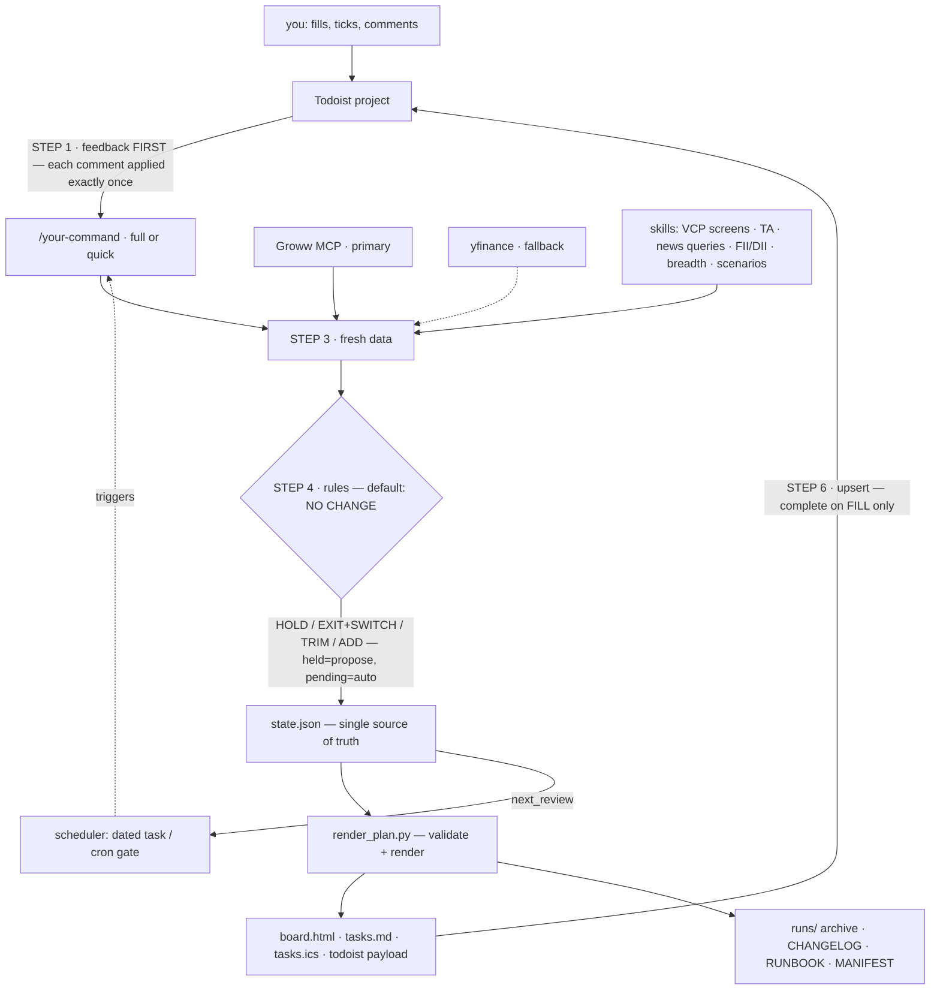

# w-bonkers

**Your AI agent runs your stock plan on rails. You just take the W.**

[](LICENSE)
[](docs/PREREQUISITES.md)
[](docs/PIPELINE.md)
[](https://somm.tf)

## The problem

Running your own portfolio means answering the same questions every single day: Did anything close below its stop? Is this dip the entry I was waiting for? What did I decide last week, and why? Do it by hand and discipline slips. Ask a chat AI and it gets worse — every conversation reinvents your plan, forgets your fills, and redraws your levels. Most plans don't die from bad picks; they die from drift.

## What w-bonkers does

It turns Claude Code or Codex into a disciplined portfolio copilot for NSE cash equity:

- **A one-time installer interviews you** — goals, corpus, risk appetite, existing holdings, even your salary PDF for tax context — and writes your plan into a single file: `state.json`.
- **A refresh command** (default `/w-bonkers`, you pick the name) re-runs the plan on your schedule: it reads your feedback first, pulls fresh market data, applies fixed rules, and changes the plan only when a rule actually fires. The default outcome is **no change**.
- **Your orders arrive as Todoist tasks** — buy zone, stop-loss and target on every one. You place the trades in your broker app, tick a task when it fills, and leave comments like `bought at 332` or `raise stop to 320`. The next run reads those before anything else.
- **Everything it fetches is archived locally** — prices, screens, news, decisions. If the internet or the AI disappears tomorrow, the folder still holds your whole plan, its history, and an offline runbook to keep running it by hand.

The core trick: **your plan is data, not vibes.** State lives in `state.json`, a deterministic Python script renders every view, and the agent may edit that state only when your feedback or a hard rule says so. Same state in, same board out — every run, any model.

> **Education only.** Not investment advice, not SEBI-registered. The agent never places orders (the broker MCP is read-only for trading) — you place every trade and confirm live prices.

## How it works



Two invariants make it drift-proof ([docs/PIPELINE.md](docs/PIPELINE.md)):

1. **`state.json` is the single source of truth** — the agent edits data, never views.
2. **`render_plan.py` is the only view-writer** — same state, byte-identical board, every run.

## Prerequisites

| What | Why | Setup |
|---|---|---|
| Claude Code **or** Codex CLI | the agent that runs everything | [docs/PREREQUISITES.md](docs/PREREQUISITES.md) |
| **Groww MCP** | live prices, **stock** holdings, margins (mutual funds aren't exposed — you provide those at install, see [ONBOARDING](docs/ONBOARDING.md)) | needs a Node-22 `mcp-remote` wrapper on port `52155` — recipe in PREREQUISITES §2 |
| **Todoist MCP** (required) | the feedback loop and reminders | PREREQUISITES §3 — swappable later, see below |
| **indian-trading-skills** pack | VCP screener, TA, news, flows, breadth, scenarios | auto-installed by the installer |
| python3 + `yfinance` | renderer + fallback prices | `pip3 install yfinance pandas niftystocks` |

## Install

```bash
git clone https://github.com/Somchandra17/w-bonkers.git ~/stocks && cd ~/stocks
```

Open **Claude Code** or **Codex** in that folder and say:

> **"Read INSTALL.md and execute it."**

The installer interviews you (goals, docs, risk), converts your PDFs to markdown, reads your Groww holdings, proposes an opening book you approve line by line, installs a refresh command named by you, fills your Todoist project, and sets up scheduling. About 15 minutes. Prep tips: [docs/ONBOARDING.md](docs/ONBOARDING.md).

## The daily loop

- Run `/w-bonkers quick` (or wait for the reminder task / cron) — it reads your ticks and comments first, pulls fresh data, applies the rules, re-renders, re-syncs.
- **Tick a BUY only when it fills** — not when you place the order.
- **Comment on any task to instruct the next run**: `bought at 332` · `raise stop to 320` · `skip` · `hold off` — each applied exactly once and answered with `applied: ...`. Full grammar: [docs/FEEDBACK.md](docs/FEEDBACK.md).
- Your board: `board.html` — opens offline in any browser.

## Scheduling

Three modes ([docs/SCHEDULING.md](docs/SCHEDULING.md)): a **dated Todoist task** (default — the plan picks its own next date), **cron** (fire daily; an internal gate makes the cadence adaptive; works with any always-on agent runner), or **both** (cron does the work, the dated task is your dead-man switch).

```cron
5 16 * * 1-5  $HOME/stocks/scripts/run_refresh.sh claude quick
```

## Your data stays yours

Committed = code, templates, docs. **Generated = yours and gitignored**: `state.json`, `personal/` (your PDFs and conversions), `runs/` (every fetch archived), `RUNBOOK.md` (offline manual), `CHANGELOG.md`, rendered views. A `git push` physically can't include them — and don't `git add -f`.

## Customize

- **Strategy inputs** (universe, screen params, add-zone) live in `state.json → meta.pinned` — edit data, not code. [docs/CUSTOMIZE.md](docs/CUSTOMIZE.md)
- **Don't like Todoist?** After setup, tell your agent: *"swap the Todoist layer for Linear / Notion / a local file"* — the sync payload is tool-agnostic and the seam is one read step plus one write step.
- **Different strategy?** v1 rules are rotation/momentum-shaped; the rule text lives in your command file — prompt your agent to re-derive them. Keep the invariants.

## Upgrading

`git pull`, then tell your agent: *"re-run INSTALL.md in upgrade mode"* — it regenerates the command and docs from the new templates using your stored answers, and never touches `state.json` without asking.

## Credits

- **[ajeeshworkspace/indian-trading-skills](https://github.com/ajeeshworkspace/indian-trading-skills)** (MIT) — the six analysis skills this engine screens and reads the market with: `nse-vcp-screener`, `technical-analyst`, `india-news-tracker`, `fii-dii-flow-tracker`, `india-market-breadth`, `scenario-analyzer`.
- **Groww MCP** (`mcp.groww.in`) — market data and portfolio. **Todoist MCP** — the feedback loop.

## Author

Built by **[Som Chandra](https://somm.tf)** — a security engineer who got tired of re-deciding the same trades every morning, so the agent does the discipline and he does the clicking. More at **[somm.tf](https://somm.tf)**. Issues and PRs welcome.

## License

MIT — see [LICENSE](LICENSE). Markets can go bonkers too; risk only what you can afford to lose.
