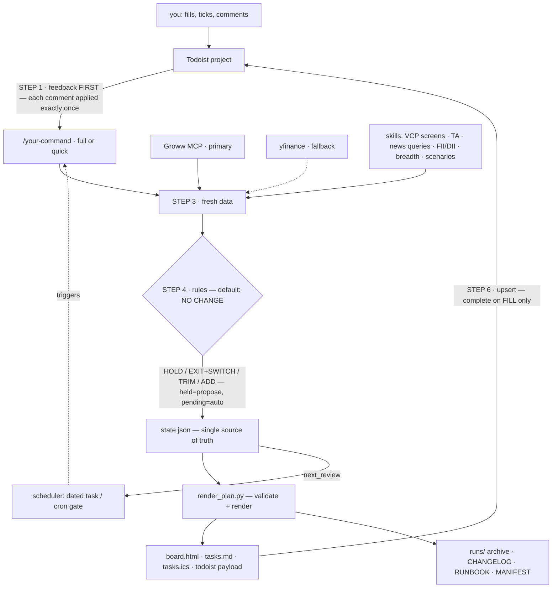

# w-bonkers 📈

**your AI agent runs your stock plan on rails. you just take the W.**

[](LICENSE)
[](docs/PREREQUISITES.md)
[](docs/PIPELINE.md)
[](https://sommm.tf)

w-bonkers turns Claude Code or Codex into a disciplined portfolio copilot for NSE cash equity: it interviews you, builds a plan into a single `state.json`, refreshes it deterministically on your schedule, talks to you through Todoist (🟢 buy zone / 🔴 stop-loss / 🎯 target on every task), and archives **everything** it ever fetches into local files — so the plan works even with no internet, no cloud, no agent. Unhinged name, boring-on-purpose engineering.

> ⚠️ **Education only.** Not investment advice, not SEBI-registered. The agent **never places orders** (the broker MCP is read-only for trading) — you place every trade and confirm live prices.

## How it works



Two invariants make it drift-proof ([docs/PIPELINE.md](docs/PIPELINE.md)):
1. **`state.json` is the single source of truth** — the agent edits data, never views.
2. **`render_plan.py` is the only view-writer** — same state, byte-identical board, every run. Default decision is **NO CHANGE**; a position changes only when your feedback or a hard rule fires.

## Prerequisites

| What | Why | Setup |
|---|---|---|
| Claude Code **or** Codex CLI | the agent that runs everything | [docs/PREREQUISITES.md](docs/PREREQUISITES.md) |
| **Groww MCP** | live prices, holdings, margins | needs a Node-22 `mcp-remote` wrapper on port `52155` — recipe in PREREQUISITES §2 |
| **Todoist MCP** *(required)* | the feedback loop + reminders | PREREQUISITES §3 — swappable later, see below |
| **indian-trading-skills** pack | VCP screener, TA, news, flows, breadth, scenarios | auto-installed by the installer |
| python3 + `yfinance` | renderer + fallback prices | `pip3 install yfinance pandas niftystocks` |

## Install

```bash
git clone https://github.com/Somchandra17/w-bonkers.git ~/stocks && cd ~/stocks
```
Open **Claude Code** or **Codex** in that folder and say:
> **"Read INSTALL.md and execute it."**

The installer interviews you (goals → docs → risk), converts your PDFs to markdown, reads your Groww holdings, proposes an opening book you approve line by line, installs a refresh command **named by you** (default `/w-bonkers`), fills your Todoist project, and sets up scheduling. ~15 minutes. Prep tips: [docs/ONBOARDING.md](docs/ONBOARDING.md).

## The daily loop

- Run `/w-bonkers quick` (or wait for the ⏰ task / cron) → it reads your ticks + comments **first**, pulls fresh data, applies the rules, re-renders, re-syncs.
- ✅ **Tick a BUY only when it FILLS** — not when you place the order.
- 💬 **Comment on any task to instruct the next run**: `bought at 332` · `raise stop to 320` · `skip` · `hold off` — applied exactly once, answered with `✓ applied: …`. Full grammar: [docs/FEEDBACK.md](docs/FEEDBACK.md).
- Your board: `board.html` — opens offline in any browser.

## Scheduling

Three modes ([docs/SCHEDULING.md](docs/SCHEDULING.md)): **Todoist ⏰ task** (default — the plan picks its own next date), **cron** (fire daily; the AUTO gate makes cadence adaptive; works with any always-on agent runner), or **both** (cron does the work, the dated task is your dead-man switch).

```cron
5 16 * * 1-5  $HOME/stocks/scripts/run_refresh.sh claude quick
```

## Your data stays yours

Committed = code, templates, docs. **Generated = yours and gitignored**: `state.json`, `personal/` (your PDFs + conversions), `runs/` (every fetch archived), `RUNBOOK.md` (offline manual), `CHANGELOG.md`, rendered views. `git push` physically can't include them — and don't `git add -f`.

## Customize

- **Strategy inputs** (universe, screen params, add-zone) live in `state.json → meta.pinned` — edit data, not code. [docs/CUSTOMIZE.md](docs/CUSTOMIZE.md)
- **Don't like Todoist?** After setup, literally tell your agent: *"swap the Todoist layer for Linear/Notion/a local file"* — the sync payload is tool-agnostic and the seam is one read step + one write step.
- **Different strategy?** v1 rules are rotation/momentum-shaped; the rule text lives in your command file — prompt your agent to re-derive them. Keep the invariants.

## Upgrading

`git pull`, then tell your agent: *"re-run INSTALL.md in upgrade mode"* — regenerates command + docs from new templates with your stored answers; never touches `state.json` without asking.

## Credits

- **[ajeeshworkspace/indian-trading-skills](https://github.com/ajeeshworkspace/indian-trading-skills)** (MIT) — the six analysis skills this engine screens and reads the market with: `nse-vcp-screener`, `technical-analyst`, `india-news-tracker`, `fii-dii-flow-tracker`, `india-market-breadth`, `scenario-analyzer`.
- **Groww MCP** (`mcp.groww.in`) — market data & portfolio. **Todoist MCP** — the feedback loop.

## Author

Built by **[Som Chandra](https://sommm.tf)** — security engineer who got tired of re-deciding the same trades every morning, so the agent does the discipline and he does the clicking. More at **[sommm.tf](https://sommm.tf)**. Issues & PRs welcome.

## License

MIT — see [LICENSE](LICENSE). Markets can go down bonkers too; risk only what you can afford to lose.
